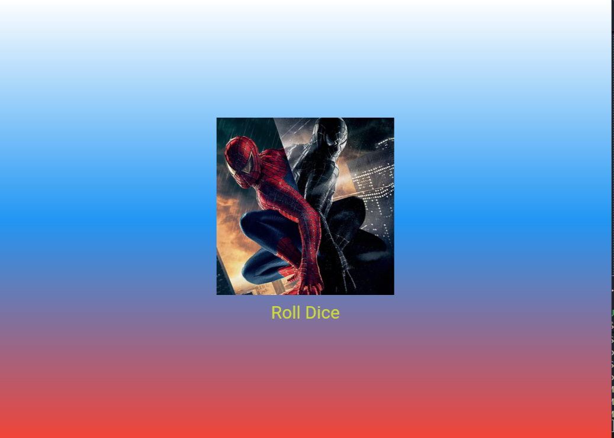

# Лабораторная работа №3. Flutter: структура UI и компонентный подход

**Студент:** Старцева П.С.

**Группа:** ИСП-231

**Дата сдачи:** 18.04.2026

## Что изучили

- Создание UI через дерево виджетов и композицию.
- Разделение кода на переиспользуемые виджеты-классы и вынос их в отдельные файлы.
- Передачу данных между виджетами через параметры конструктора (внедрение зависимостей).
- Работу с ресурсами (assets): добавление изображений, подключение в `pubspec.yaml`.
- Управление состоянием: разницу между `StatelessWidget` и `StatefulWidget`, использование `setState()` для обновления интерфейса.
- Генерацию случайных чисел и обработку нажатий кнопок.

## Скриншот финального приложения



## Ссылка на репозиторий

[Github repository](https://github.com/ssscvlnk/Flutter_Lab3.git)

## Инструкция по запуску

1. Клонируйте репозиторий:
   ```bash
   git clone https://github.com/ssscvlnk/Flutter_Lab3.git
   cd Flutter_Lab3
   ```
2. Установите зависимости:
   ```bash
   flutter pub get
   ```
3. Подключите устройство или эмулятор, либо используйте Chrome:
   ```bash
   flutter run -d chrome
   ```
4. Дождитесь сборки и наслаждайтесь приложением.

## Ответы на вопросы:

### 1. Зачем выносить виджеты в отдельные файлы? Что изменится, если держать всё в `main.dart`?

Вынос виджетов в отдельные файлы улучшает читаемость, поддержку и переиспользование кода. Если держать всё в `main.dart`, файл быстро разрастается, становится сложно ориентироваться в коде, появляются конфликты при работе в команде, а переиспользовать виджет в другом проекте или месте приложения без копирования всего файла невозможно.

### 2. Что такое `BuildContext`? Почему метод `build()` принимает его как параметр?

`BuildContext` — это ссылка на местоположение виджета в дереве виджетов. Он предоставляет доступ к таким возможностям, как получение темы, навигация между экранами (`Navigator`), доступ к InheritedWidget и т.д. Метод `build()` принимает его как параметр, потому что при сборке виджета часто требуется знать окружение, в котором он находится (например, размер экрана, текущая локаль, родительские виджеты).

### 3. Чем `StatelessWidget` отличается от `StatefulWidget`? Приведите пример, когда нужен каждый из них.

- **StatelessWidget** — не имеет внутреннего изменяемого состояния. Его внешний вид зависит только от параметров, переданных при создании. **Пример:** простая кнопка с фиксированной надписью, иконка, текст, статичное изображение.
- **StatefulWidget** — имеет внутреннее состояние, которое может меняться во время жизни виджета, и при вызове `setState()` перестраивает свой UI. **Пример:** счётчик нажатий, форма ввода с проверкой полей, таймер, анимация, игра с кубиком (наше приложение).

### 4. Почему `Random()` создаётся на уровне файла, а не внутри `rollDice()`?

Создание `Random()` на уровне файла (один объект на всё приложение) эффективнее, чем создание нового генератора при каждом нажатии кнопки. 

Конструктор `Random()` по умолчанию использует системное время для инициализации. 

При быстрых последовательных вызовах несколько объектов могут получить одинаковое начальное значение и генерировать одинаковые числа. 

Кроме того, частое создание объектов нагружает сборщик мусора. Один переиспользуемый экземпляр даёт более равномерное распределение случайных чисел и лучшую производительность.